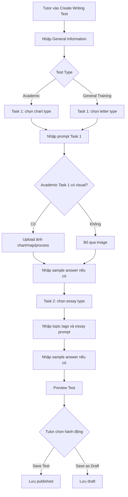
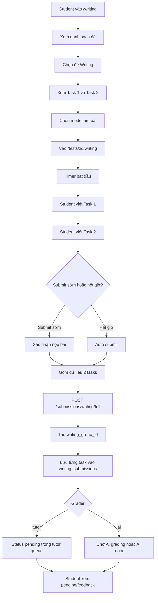
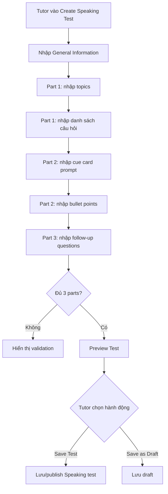
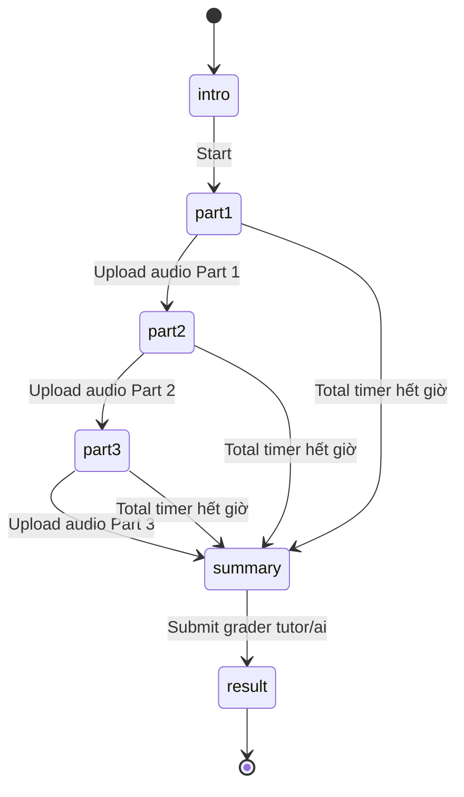
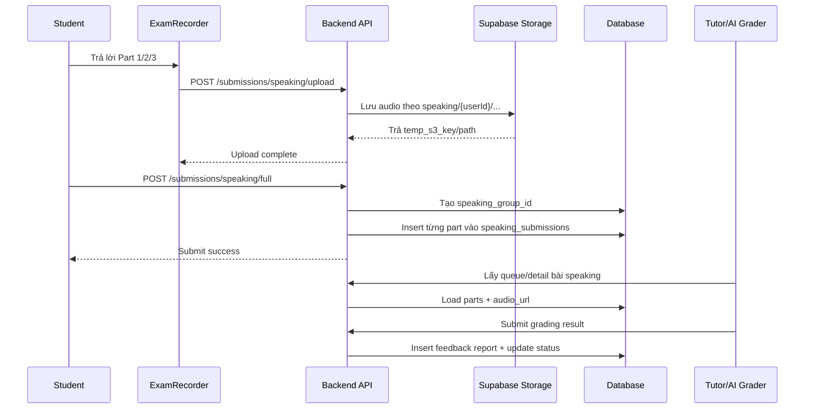
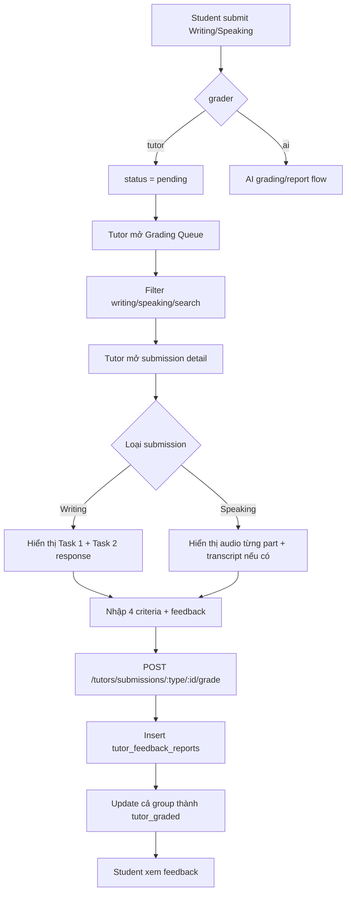
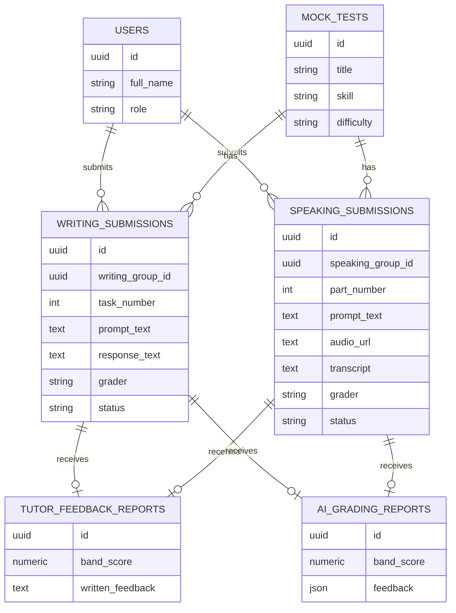

# Guideline: Reading, Listening, Writing và Speaking

Tài liệu này mô tả cách triển khai và sử dụng chức năng **Advanced Mode (Markers)** cho nhập nhanh câu hỏi Reading/Listening, đồng thời bổ sung guideline nghiệp vụ cho Writing/Speaking. Chức năng marker hiện được dùng trong modal **Bulk Add** của tutor, cho phép dán nhiều block câu hỏi trong một lần bằng các marker như `[MCQ]`, `[T/F/NG]`, `[SENTENCE COMPLETION]`.

## 1. Mục tiêu chức năng

Advanced Mode giúp tutor/importer:

- Dán nhiều nhóm câu hỏi cùng lúc.
- Tự động tách block câu hỏi theo marker.
- Tự nhận diện loại câu hỏi từ marker.
- Tự parse câu hỏi, đáp án đúng và giải thích.
- Preview kết quả trước khi thêm vào Reading passage hoặc Listening section.

## 2. File/chức năng chính trong dự án hiện tại

Frontend:

- `frontend/src/components/tutor/BulkAddModal.jsx`
  - Hiển thị modal nhập nhanh.
  - Cho chọn `Simple Mode`, `Advanced Mode (Markers)`, `Smart Mode`.
  - Gọi parser tương ứng theo mode.
  - Preview block/câu hỏi sau khi parse.
  - Gửi `newBlocks` về form cha qua `onConfirm`.

- `frontend/src/utils/questionParser.js`
  - `parseAdvancedText(rawText)`: xử lý Advanced Mode.
  - `normalizeMarker(markerText)`: map marker về question type.
  - `MARKER_ALIASES`: danh sách marker được hỗ trợ.
  - `parseBulkText(text, blockType)`: parse nội dung từng block.
  - `validateParsedQuestions(questions, blockType)`: validate câu hỏi/đáp án.

- `frontend/src/pages/tutor/TutorReadingFormPage.jsx`
  - Mở Bulk Add cho từng passage.
  - Sau khi confirm, append block mới vào `passages[x].blocks`.

- `frontend/src/pages/tutor/TutorListeningFormPage.jsx`
  - Mở Bulk Add cho từng section.
  - Sau khi confirm, append block mới vào `sections[x].blocks`.

## 3. Luồng xử lý tổng quát

1. Tutor bấm `+ Nhập Nhanh (Bulk Add)` tại một Reading passage hoặc Listening section.
2. Modal `BulkAddModal` mở ra.
3. Tutor chọn `Advanced Mode (Markers)`.
4. Tutor dán text bắt đầu bằng một marker hợp lệ, ví dụ `[MCQ]`.
5. `parseAdvancedText(rawText)` kiểm tra dòng đầu tiên có phải marker không.
6. Parser tách nội dung thành nhiều block theo các dòng marker.
7. Mỗi block được parse bằng `parseBulkText(blockText, blockType)`.
8. `validateParsedQuestions` kiểm tra:
   - Có câu hỏi hay không.
   - MCQ có ít nhất 2 option.
   - Mỗi câu có đúng 1 đáp án đúng.
   - Completion/Short Answer/T/F/NG/Y/N/NG có đáp án.
9. Modal hiển thị preview.
10. Tutor bấm `Xác nhận Thêm`.
11. Form cha nhận `newBlocks` và thêm vào passage/section hiện tại.

## 4. Quy tắc định dạng Advanced Mode

### 4.1. Marker bắt buộc nằm ở dòng đầu tiên

Dòng đầu tiên không được là câu hỏi. Phải là marker dạng:

```text
[MCQ]
```

Nếu không có marker ở dòng đầu tiên, parser trả lỗi:

```text
Không tìm thấy marker hợp lệ ở dòng đầu tiên. Vui lòng thêm marker như [MCQ] hoặc [T/F/NG].
```

### 4.2. Marker phải đứng riêng một dòng

Đúng:

```text
[MCQ]
1. What is the main idea?
A. Option A
*B. Option B
```

Sai:

```text
[MCQ] 1. What is the main idea?
```

### 4.3. Mỗi câu hỏi bắt đầu bằng số thứ tự

Định dạng:

```text
1. Nội dung câu hỏi
2. Nội dung câu hỏi
```

Parser hiện nhận câu hỏi bằng regex:

```text
^(\d+)\.\s*(.*)
```

Vì vậy nên dùng `1.`, `2.`, `3.` thay vì `1)`, `Q1`, `Question 1`.

### 4.4. Đáp án đúng dùng dấu `*`

Với Multiple Choice, đặt `*` trước option đúng:

```text
1. What does the speaker suggest?
A. Buying a new ticket
*B. Changing the reservation
C. Calling later
D. Waiting outside
```

Với Completion/Short Answer, đặt `*` ở dòng đáp án:

```text
1. The meeting starts at ____.
*9:30
```

Với T/F/NG hoặc Y/N/NG, đáp án có thể viết trên dòng riêng:

```text
1. The writer supports the new policy.
*TRUE
```

Các đáp án được chuẩn hóa dạng uppercase cho:

- `TRUE`
- `FALSE`
- `NOT GIVEN`
- `YES`
- `NO`

### 4.5. Giải thích đáp án

Có thể thêm giải thích sau đáp án bằng một trong hai prefix:

```text
Giải thích: Nội dung giải thích
```

hoặc:

```text
Explanation: Explanation text
```

Nếu giải thích nhiều dòng, các dòng sau prefix sẽ được nối tiếp vào explanation của câu hiện tại.

## 5. Marker được hỗ trợ

Marker được khai báo trong `MARKER_ALIASES`.

| Question type nội bộ | Marker/alias có thể dùng |
| --- | --- |
| `Multiple Choice` | `[Multiple Choice]`, `[MCQ]` |
| `True/False/Not Given` | `[True/False/Not Given]`, `[True False Not Given]`, `[T/F/NG]`, `[TFNG]` |
| `Yes/No/Not Given` | `[Yes/No/Not Given]`, `[Yes No Not Given]`, `[Y/N/NG]`, `[YNNG]` |
| `Sentence Completion` | `[Sentence Completion]`, `[Completion]`, `[Fill in the Blank]`, `[Fill in the Blanks]` |
| `Short-answer Questions` | `[Short Answer]`, `[Short Answer Questions]`, `[SAQ]` |
| `Note/Table/Flow-chart Completion` | `[Note Completion]`, `[Table Completion]`, `[Flow-chart Completion]` |
| `Summary Completion` | `[Summary Completion]` |
| `Matching Headings` | `[Matching Headings]`, `[Matching_Heading]`, `[Matching_Headings]` |
| `Matching Information` | `[Matching Information]`, `[Matching_Info]` |
| `Multiple Choice (Multiple)` | `[MCQ_MULTI]`, `[Multiple Choice Multi]` |

Lưu ý quan trọng: Advanced Mode hiện dùng parser legacy `parseBulkText`. Parser này xử lý tốt nhất các dạng:

- Multiple Choice một đáp án.
- True/False/Not Given.
- Yes/No/Not Given.
- Sentence/Summary/Note/Table/Flow-chart Completion.
- Short-answer Questions.

Các dạng `Matching Headings`, `Matching Information`, `MCQ_MULTI` có marker alias nhưng parser legacy chưa parse đầy đủ options/group format như Smart Mode. Nếu dự án khác cần các dạng này, nên:

- Dùng Smart Mode cho đề IELTS raw text, hoặc
- Bổ sung parser riêng cho matching/multi-select, hoặc
- Import bằng Advanced Mode rồi chỉnh thủ công trong editor.

## 6. Ví dụ dùng cho Reading

### 6.1. Reading - Multiple Choice + T/F/NG

```text
[MCQ]
1. What is the main purpose of paragraph A?
A. To describe a historical event
*B. To introduce the topic of the passage
C. To compare two scientific theories
D. To criticize a common belief
Explanation: Paragraph A gives background and introduces the central issue.

2. Which factor is mentioned as a cause of the problem?
*A. Rapid population growth
B. Improved farming technology
C. Government investment
D. Lower transport costs
Explanation: The passage directly links the problem to population growth.

[T/F/NG]
3. The research was conducted in three countries.
*FALSE
Explanation: The passage states that the research was conducted in two countries.

4. The author believes further studies are necessary.
*TRUE
Explanation: The final paragraph recommends additional research.

5. The project received funding from a private company.
*NOT GIVEN
Explanation: No funding source is mentioned.
```

### 6.2. Reading - Completion

```text
[SENTENCE COMPLETION]
6. The first experiment was carried out in ____.
*1998
Explanation: The date is given in paragraph B.

7. Participants were asked to record their ____ every morning.
*sleep patterns
Explanation: The passage says participants kept a daily sleep-pattern record.

[SUMMARY COMPLETION]
8. The new system reduced the amount of ____ needed.
*manual labour
Explanation: The summary refers to the reduction of manual labour.
```

## 7. Ví dụ dùng cho Listening

### 7.1. Listening - Multiple Choice

```text
[MCQ]
1. Why does the woman call the office?
A. To cancel a booking
*B. To change a reservation
C. To request a refund
D. To ask for directions
Explanation: She says she needs to move the reservation to another date.

2. What time is the appointment now?
A. 8:15
B. 8:45
*C. 9:30
D. 10:00
Explanation: The receptionist confirms the new time is 9:30.
```

### 7.2. Listening - Form/Note Completion

```text
[NOTE COMPLETION]
3. Customer name: ____.
*Martin Hale
Explanation: The speaker spells the customer's name as Martin Hale.

4. Contact number: ____.
*07764 882193
Explanation: This is the phone number repeated by the receptionist.

5. Preferred room: ____.
*conference room B
Explanation: The caller asks specifically for conference room B.
```

### 7.3. Listening - Short Answer

```text
[SAQ]
6. What should visitors bring to the workshop?
*a notebook
Explanation: The speaker says visitors should bring a notebook.

7. Where will the group meet?
*main entrance
Explanation: The guide tells everyone to meet at the main entrance.
```

## 8. Cấu trúc dữ liệu block sau khi parse

Sau khi parse thành công, `parseAdvancedText` trả về:

```js
{
  blocks: [
    {
      id: Number,
      type: "Multiple Choice",
      range: "1-2",
      questions: [
        {
          id: Number,
          text: "Question text",
          options: [
            { id: Number, text: "Option A" },
            { id: Number, text: "Option B" }
          ],
          correctAnswers: [Number],
          explanation: "Explanation text"
        }
      ],
      options: []
    }
  ],
  errors: null
}
```

Với Completion/Short Answer/T/F/NG:

```js
{
  id: Number,
  text: "Question text",
  correctAnswer: "Correct answer",
  explanation: "Explanation text"
}
```

## 9. Tích hợp vào dự án khác

### 9.1. Tách parser thành utility

Nên copy hoặc port các phần sau:

- `MARKER_ALIASES`
- `normalizeMarker`
- `parseAdvancedText`
- `parseBulkText`
- `validateParsedQuestions`

Nếu dự án khác đã có canonical question type riêng, thêm một bước mapping sau `normalizeMarker`.

Ví dụ mapping từ legacy label sang canonical type:

```js
const LEGACY_TO_CANONICAL = {
  'Multiple Choice': 'MULTIPLE_CHOICE_SINGLE',
  'True/False/Not Given': 'TRUE_FALSE_NOT_GIVEN',
  'Yes/No/Not Given': 'YES_NO_NOT_GIVEN',
  'Sentence Completion': 'SENTENCE_COMPLETION',
  'Summary Completion': 'SUMMARY_COMPLETION',
  'Note/Table/Flow-chart Completion': 'NOTE_COMPLETION',
  'Short-answer Questions': 'SHORT_ANSWER_QUESTIONS',
};
```

### 9.2. Tích hợp UI

UI tối thiểu cần có:

- Radio/select chọn mode: `simple`, `advanced`, `smart` nếu có.
- Textarea để dán raw text.
- Preview panel hiển thị block/câu hỏi/đáp án.
- Alert lỗi validation.
- Button confirm chỉ enable khi:
  - Text không rỗng.
  - Không có validation errors.
  - Có ít nhất một block parse được.

### 9.3. Tích hợp Reading

Reading thường có cấu trúc:

```js
passages = [
  {
    id: 1,
    title: '',
    content: '',
    instruction: '',
    defaultRange: '1-13',
    blocks: []
  }
]
```

Khi confirm:

```js
setPassages(prev => prev.map(p =>
  p.id === targetPassageId
    ? { ...p, blocks: [...p.blocks, ...newBlocks] }
    : p
));
```

### 9.4. Tích hợp Listening

Listening thường có cấu trúc:

```js
sections = [
  {
    id: 1,
    title: '',
    transcript: '',
    showTranscript: true,
    defaultRange: '1-10',
    blocks: []
  }
]
```

Khi confirm:

```js
setSections(prev => prev.map(s =>
  s.id === targetSectionId
    ? { ...s, blocks: [...s.blocks, ...newBlocks] }
    : s
));
```

## 10. Validation nên giữ lại

Nên giữ các rule sau khi port sang dự án khác:

- Text nhập không được rỗng.
- Dòng đầu tiên của Advanced Mode phải là marker hợp lệ.
- Marker không hỗ trợ phải báo rõ marker và dòng lỗi.
- Câu hỏi phải bắt đầu bằng số thứ tự dạng `1.`
- MCQ cần ít nhất 2 options.
- MCQ chỉ cho 1 đáp án đúng nếu là single choice.
- Câu nào cũng phải có đáp án đúng.
- Không cho confirm nếu còn lỗi parse/validation.

## 11. Lưu ý khi đưa sang dự án khác

1. Tên file user yêu cầu trong repo này là `guildline.md`; nếu tạo mới ở dự án khác nên cân nhắc đặt đúng chính tả là `guideline.md`.
2. Advanced Mode hiện không tự tính range theo số câu thực tế toàn bài, mà mỗi block sinh ra `range: "1-n"` theo số câu trong block. Nếu cần range đúng IELTS như `14-18`, nên cải tiến parser để lấy số đầu/cuối từ `questionOrder`.
3. Nếu dùng canonical type dạng uppercase, cần mapping từ label legacy sang canonical type trước khi render editor hoặc lưu DB.
4. Với Listening, các marker như `[NOTE COMPLETION]`, `[SENTENCE COMPLETION]`, `[SAQ]`, `[MCQ]` phù hợp hơn với editor hiện tại.
5. Với Matching hoặc multi-select, nên ưu tiên Smart Mode hoặc viết parser riêng vì Advanced Mode hiện mới nhận marker chứ chưa parse đầy đủ cấu trúc options nâng cao.
6. Nên preview và cho tutor chỉnh lại block sau import trước khi submit/publish.

## 12. Checklist kiểm thử nhanh

- Dán text bắt đầu bằng `[MCQ]` parse ra đúng số block/câu.
- MCQ thiếu dấu `*` phải báo lỗi.
- MCQ có 2 dấu `*` trong cùng câu phải báo lỗi single-answer.
- Dán text bắt đầu không phải marker phải báo lỗi.
- Dùng marker không hỗ trợ như `[ABC]` phải báo lỗi marker.
- Dán nhiều marker liên tiếp phải tạo nhiều block.
- Reading confirm thêm block vào đúng passage.
- Listening confirm thêm block vào đúng section.
- Save/submit bị chặn nếu còn câu chưa có đáp án.

---

## 13. Bổ sung nghiệp vụ Writing và Speaking

Writing và Speaking là nhóm kỹ năng **subjective testing**. Khác với Reading/Listening, hai kỹ năng này không dùng marker để tạo câu hỏi objective, mà đi theo luồng:

- Tutor tạo đề theo cấu trúc IELTS chuẩn.
- Student làm bài hoặc ghi âm.
- Student chọn người chấm: `tutor` hoặc `ai`.
- Hệ thống lưu submission theo group.
- Tutor/AI chấm theo 4 tiêu chí IELTS.
- Student xem feedback, band score và lịch sử.

Các sơ đồ bên dưới dùng Mermaid. Khi mở bằng GitHub/GitLab/VS Code Markdown Preview, chúng sẽ render thành hình ảnh quy trình nghiệp vụ.

## 14. Nghiệp vụ Writing

### 14.1. File/chức năng chính

Frontend:

- `frontend/src/pages/tutor/TutorWritingFormPage.jsx`
  - Tutor tạo/sửa đề Writing.
  - Gồm General Information, Task 1, Task 2.
  - Task 1 Academic có thể upload hình/chart.
  - Có `Preview Test`, `Save Test`, `Save as Draft`.

- `frontend/src/pages/subjective-testing/WritingPage.jsx`
  - Student xem danh sách đề Writing.
  - Xem danh sách Task của một đề.
  - Chọn chế độ làm bài qua `ModeSelector`.

- `frontend/src/pages/subjective-testing/WritingTestPage.jsx`
  - Màn hình làm bài Writing.
  - Hiển thị đề bên trái, editor bên phải.
  - Có timer, chuyển Task 1/Task 2, auto submit khi hết giờ.
  - Submit full test qua `gradingService.submitFullWriting`.

- `frontend/src/components/grading/WritingEditor.jsx`
  - Nhập bài viết từng task.
  - Đếm ký tự và số từ.
  - Chọn `tutor` hoặc `ai`.
  - Validate response không được rỗng.
  - Kiểm tra quota nếu chọn AI.

Backend:

- `backend/src/services/submission.service.js`
  - `submitFullWriting(userId, testId, grader, tasks)`.
  - Tạo `writing_group_id`.
  - Lưu mỗi task thành một dòng trong `writing_submissions`.

- `backend/src/services/tutor.service.js`
  - `getQueue`: lấy queue chấm Writing/Speaking.
  - `getSubmissionDetail`: lấy đầy đủ các task trong group.
  - `gradeSubmission`: tutor chấm và cập nhật status cả group.

### 14.2. Hình nghiệp vụ: Tutor tạo đề Writing



### 14.3. Cấu trúc form Writing

`formData`:

```js
{
  title: '',
  description: '',
  difficulty: '',
  duration: 60,
  testType: 'academic'
}
```

`task1`:

```js
{
  chartType: '',
  letterType: '',
  prompt: '',
  sampleAnswer: '',
  imageUrl: '',
  imageName: ''
}
```

`task2`:

```js
{
  essayType: '',
  topicTags: '',
  prompt: '',
  sampleAnswer: ''
}
```

### 14.4. Quy tắc nghiệp vụ khi tạo Writing

- `title` bắt buộc.
- Task 1 và Task 2 đều phải có `prompt`.
- Writing Academic Task 1 có thể có ảnh chart/table/map/process.
- Ảnh Task 1 chỉ nhận file image và tối đa 5MB ở frontend hiện tại.
- Task 1 tối thiểu 150 từ.
- Task 2 tối thiểu 250 từ.
- Duration mặc định 60 phút.
- Difficulty gồm `beginner`, `intermediate`, `advanced`.
- Khi save, payload phải có `skill: 'writing'`.

Payload tạo/sửa đề Writing nên có dạng:

```js
{
  title,
  description,
  difficulty,
  duration,
  testType,
  skill: 'writing',
  status: 'published' | 'draft',
  isPublished: true | false,
  publishAt: ISODate | null,
  task1,
  task2
}
```

### 14.5. Hình nghiệp vụ: Student làm bài Writing



### 14.6. Payload submit Writing

Frontend gọi:

```js
gradingService.submitFullWriting({
  test_id: exam.id,
  grader: 'tutor' | 'ai',
  tasks: [
    {
      task_number: 1,
      prompt_text: 'Task 1 prompt',
      response_text: 'Student answer',
      grader: 'tutor'
    },
    {
      task_number: 2,
      prompt_text: 'Task 2 prompt',
      response_text: 'Student answer',
      grader: 'tutor'
    }
  ]
});
```

Backend lưu:

```js
{
  writing_group_id: UUID,
  tasks: [
    {
      id: UUID,
      user_id: UUID,
      test_id: UUID | null,
      task_number: 1,
      prompt_text: '',
      response_text: '',
      grader: 'tutor' | 'ai',
      status: 'pending'
    }
  ]
}
```

### 14.7. Tiêu chí chấm Writing

Writing dùng 4 tiêu chí IELTS:

| Tiêu chí | Field gợi ý |
| --- | --- |
| Task Achievement / Task Response | `taskAchievementScore` |
| Coherence & Cohesion | `coherenceScore` |
| Lexical Resource | `lexicalScore` |
| Grammatical Range & Accuracy | `grammarScore` |

Band score tổng nên tính từ trung bình 4 tiêu chí, làm tròn theo chuẩn IELTS nếu dự án có helper riêng.

```js
{
  bandScore: 6.5,
  taskAchievementScore: 6.5,
  coherenceScore: 6.0,
  lexicalScore: 6.5,
  grammarScore: 6.0,
  writtenFeedback: 'Feedback text'
}
```

## 15. Nghiệp vụ Speaking

### 15.1. File/chức năng chính

Frontend:

- `frontend/src/pages/tutor/TutorSpeakingFormPage.jsx`
  - Tutor tạo/sửa đề Speaking.
  - Gồm Part 1, Part 2, Part 3.
  - Có `Preview Test`, `Save Test`, `Save as Draft`.

- `frontend/src/pages/subjective-testing/SpeakingPage.jsx`
  - Student xem danh sách đề Speaking.
  - Xem chi tiết 3 phần của một đề.
  - Chọn mode làm bài qua `ModeSelector`.

- `frontend/src/pages/subjective-testing/SpeakingTestPage.jsx`
  - State machine cho bài thi Speaking.
  - Các phase: `intro`, `part1`, `part2`, `part3`, `summary`, `result`.
  - Part 1/3 ghi âm theo từng nhóm câu hỏi.
  - Part 2 có cue card, thời gian chuẩn bị và thời gian nói.
  - Submit full test qua `gradingService.submitFullSpeaking`.

- `frontend/src/components/grading/ExamRecorder.jsx`
  - Ghi âm và upload audio.

- `frontend/src/components/grading/Part2Screen.jsx`
  - Màn hình cue card Part 2.

- `frontend/src/components/grading/SpeakingSummaryScreen.jsx`
  - Tổng hợp các part đã ghi âm trước khi nộp.

Backend:

- `backend/src/services/submission.service.js`
  - `submitFullSpeaking(userId, testId, grader, parts)`.
  - Tạo `speaking_group_id`.
  - Validate audio path thuộc user hiện tại.
  - Lưu từng part vào `speaking_submissions`.

- `backend/src/middleware/upload.middleware.js`
  - Upload audio Speaking.

- `backend/src/services/tutor.service.js`
  - Lấy detail bài Speaking.
  - Chấm speaking group.
  - Generate transcript nếu cần.

### 15.2. Hình nghiệp vụ: Tutor tạo đề Speaking



### 15.3. Cấu trúc form Speaking

`formData`:

```js
{
  title: '',
  description: '',
  difficulty: 'intermediate',
  duration: 15
}
```

`part1`:

```js
{
  topics: 'Hometown, Work, Studies',
  questions: '- What is your hometown like?\n- Do you work or study?'
}
```

`part2`:

```js
{
  prompt: 'Describe a memorable journey you have made.',
  bulletPoints: '- Where you went\n- How you traveled\n- Why you went\n- Explain why it was memorable'
}
```

`part3`:

```js
{
  questions: '- How has transportation changed?\n- Will people travel more in the future?'
}
```

Payload tạo/sửa đề Speaking hiện map về `passages`:

```js
{
  title,
  description,
  difficulty,
  duration,
  skill: 'speaking',
  publishAt,
  passages: [
    {
      title: 'Speaking Part 1',
      instruction: part1.topics,
      content: part1.questions,
      blocks: []
    },
    {
      title: part2.prompt || 'Speaking Part 2',
      instruction: 'Cue card bullet points',
      content: part2.bulletPoints,
      blocks: []
    },
    {
      title: 'Speaking Part 3',
      instruction: 'Follow-up questions',
      content: part3.questions,
      blocks: []
    }
  ]
}
```

### 15.4. Quy tắc nghiệp vụ khi tạo Speaking

- `title` bắt buộc.
- Phải hoàn thành đủ 3 phần trước khi save:
  - Part 1 questions.
  - Part 2 prompt.
  - Part 2 bullet points.
  - Part 3 questions.
- Duration mặc định 15 phút.
- Part 1 thường 4-5 phút.
- Part 2 gồm 1 phút chuẩn bị và tối đa 2 phút nói.
- Part 3 thường 4-5 phút.
- Mỗi câu hỏi nên viết mỗi dòng một câu để parser `splitLines` tách đúng.

### 15.5. Hình nghiệp vụ: Student làm bài Speaking



### 15.6. Hình nghiệp vụ: Audio và submission Speaking



### 15.7. Payload submit Speaking

Frontend gọi:

```js
gradingService.submitFullSpeaking({
  test_id: exam.id.toString(),
  grader: 'tutor' | 'ai',
  parts: [
    {
      part_number: 1,
      temp_s3_key: 'speaking/user-id/audio-1.webm',
      prompt_text: 'Part 1 questions'
    },
    {
      part_number: 2,
      temp_s3_key: 'speaking/user-id/audio-2.webm',
      prompt_text: 'Cue card prompt and bullet points'
    },
    {
      part_number: 3,
      temp_s3_key: 'speaking/user-id/audio-3.webm',
      prompt_text: 'Part 3 questions'
    }
  ]
});
```

Backend lưu:

```js
{
  speaking_group_id: UUID,
  parts: [
    {
      id: UUID,
      user_id: UUID,
      test_id: UUID | null,
      part_number: 1,
      prompt_text: '',
      audio_url: '',
      grader: 'tutor' | 'ai',
      status: 'pending'
    }
  ]
}
```

### 15.8. Tiêu chí chấm Speaking

Speaking dùng 4 tiêu chí IELTS:

| Tiêu chí | Field gợi ý |
| --- | --- |
| Fluency & Coherence | `fluencyScore` |
| Lexical Resource | `lexicalScore` |
| Grammatical Range & Accuracy | `grammarScore` |
| Pronunciation | `pronunciationScore` |

Payload chấm Speaking:

```js
{
  bandScore: 6.5,
  fluencyScore: 6.5,
  lexicalScore: 6.0,
  grammarScore: 6.5,
  pronunciationScore: 6.0,
  writtenFeedback: 'Feedback text'
}
```

## 16. Nghiệp vụ chấm điểm Tutor cho Writing/Speaking

### 16.1. Hình nghiệp vụ: Tutor grading queue



### 16.2. Grouping submission

Writing:

- Một lần làm full Writing tạo một `writing_group_id`.
- Task 1 và Task 2 là hai dòng trong `writing_submissions`.
- Tutor chấm theo group, report thường gắn với task đại diện đầu tiên.
- Khi chấm xong, toàn bộ task trong group được update `status = 'tutor_graded'`.

Speaking:

- Một lần làm full Speaking tạo một `speaking_group_id`.
- Part 1, Part 2, Part 3 là ba dòng trong `speaking_submissions`.
- Tutor chấm theo group, report thường gắn với part đại diện đầu tiên.
- Khi chấm xong, toàn bộ part trong group được update `status = 'tutor_graded'`.

### 16.3. Hình dữ liệu tổng quan



## 17. Checklist kiểm thử Writing/Speaking

Writing:

- Tạo đề Writing thiếu title phải bị chặn.
- Tạo đề Writing thiếu Task 1 hoặc Task 2 prompt phải bị chặn.
- Academic Task 1 upload file không phải image phải báo lỗi.
- Academic Task 1 upload image lớn hơn 5MB phải báo lỗi.
- Preview hiển thị đúng Task 1, Task 2, image và sample answer.
- Student không đăng nhập không được bắt đầu làm bài.
- Student không nhập response ở một task thì không submit được.
- Chọn AI khi quota bằng 0 phải bị chặn.
- Submit full Writing tạo cùng một `writing_group_id` cho Task 1 và Task 2.
- Tutor chấm xong thì cả group chuyển `tutor_graded`.

Speaking:

- Tạo đề Speaking thiếu title phải bị chặn.
- Thiếu Part 1 questions, Part 2 prompt, Part 2 bullet points hoặc Part 3 questions phải bị chặn.
- Preview hiển thị đúng 3 parts.
- Student không đăng nhập không được bắt đầu làm bài.
- State phải đi đúng thứ tự `intro -> part1 -> part2 -> part3 -> summary -> result`.
- Mỗi part ghi âm xong phải có `temp_s3_key`.
- Backend phải reject audio path không bắt đầu bằng `speaking/{userId}/`.
- Submit full Speaking tạo cùng một `speaking_group_id` cho 3 parts.
- Tutor mở detail phải nghe được audio từng part.
- Tutor chấm xong thì cả group chuyển `tutor_graded`.
